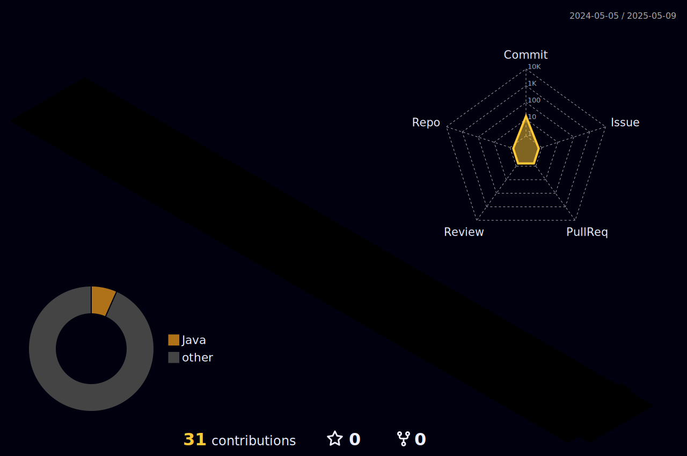
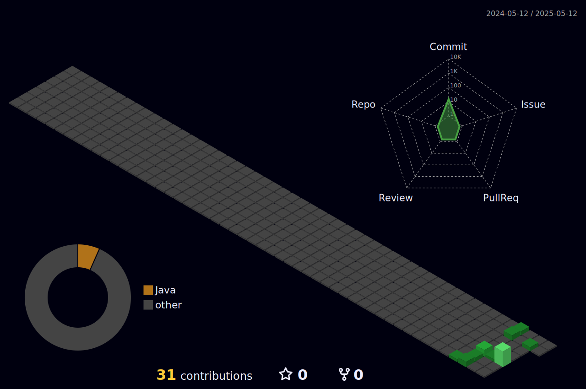

# Anderson Martins :man_technologist::love_you_gesture:

Hello!  

I'm a software developer with 10 years of experience, currently working at Magis5 as a Software Engineer and at Betacorp, my own company, as Founder and Software Engineer.  

My main focus is backend development, using Java and the Spring framework to build robust and scalable software solutions. Outside of work, I pursue continuous growth through studying and reading.

## Contact

  
  
  

## Stats

  

  
profile-night-rainbow.svg
  
profile-night-green.svg

## Skills

  
  
  
  
  
  
   
  
  
  
   
  
   
  
  

## Studying

:zap: Python  
:zap: Go Lang

---

Thanks for visiting! Feel free to explore my projects. :rocket:
